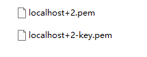

# 配置本地开发时的 https 环境

在开发某些功能时, 需要在本地服务器启用 Https 协议. 解决方案是在本地服务器中使用自签证书. 同时, 为了解决浏览器信任问题, 我们需要将自签证书使用的 CA 证书添加到系统或浏览器的可信 CA 证书中. 本文使用 `mkcert` 完成上述流程.

## 安装 mkcert

Windows 中可以使用 Chocolatey 安装 mkcert, 也可以在[GitHub](https://github.com/FiloSottile/mkcert/releases)上下载安装包.

```bash
choco install mkcert
```

## 加入本地可信 CA

将 mkcert 使用的根证书加入本地可信 CA 中, 这样由 mkcert 生成, 签发的证书在本地都是可信的。

```bash
mkcert -install
```

Windows 系统可打开"管理用户证书"功能, 查找到 mkcert 的根证书证明操作生效.


## 生成自签证书

```bash
mkcert domain1 [domain2 [...]]
```

直接跟多个要签发的域名或 ip 就行了，比如签发一个仅本机访问的证书(可以通过 127.0.0.1 和 localhost，以及 ipv6 地址::1 访问)

```bash
mkcert localhost 127.0.0.1 ::1
```

成功生成了 localhost+2.pem 证书文件和 localhost+2-key.pem 私钥文件



## 使用证书文件

在本地的 node 服务中使用证书, 不同项目的配置本质上都是将 pem 文件传递给`https.createServer`函数

### Vite 项目配置

```ts
{
  server: {
    https: {
      // 填入实际的证书与私钥文件名称及路径
      key: fs.readFileSync('./localhost+2-key.pem'),
      cert: fs.readFileSync('./localhost+2.pem'),
    }
  }
}
```

### Webpack 项目配置

```ts
{
  devServer: {
    https: {
      // 填入实际的证书与私钥文件名称及路径
      key: fs.readFileSync('./localhost+2-key.pem'),
      cert: fs.readFileSync('./localhost+2.pem'),
    }
  }
}
```

## 配置后的效果


## ref

- [掘金:【Vite】配置 HTTPS&自签名证书](https://juejin.cn/post/7104650674880643108)
- [掘金:本地 https 服务搭建指南](https://juejin.cn/post/6844904116481687565)
- [简书:本地 https 快速解决方案——mkcert](https://www.jianshu.com/p/7cb5c2cffaaa)
- [GitHub:mkcert](https://github.com/FiloSottile/mkcert)
