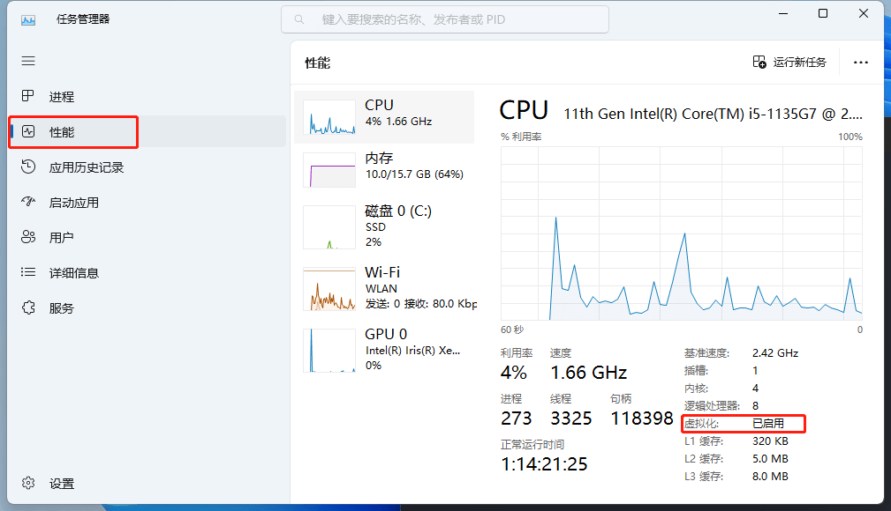
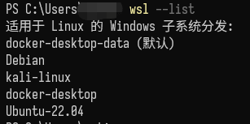
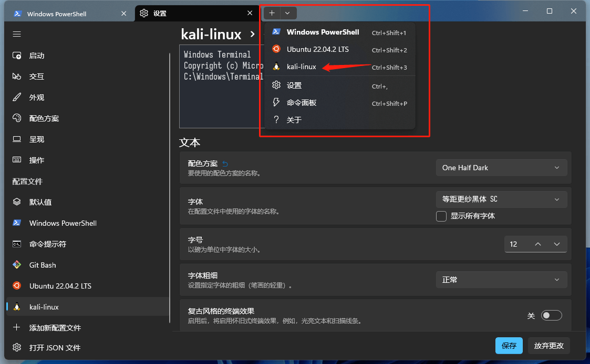
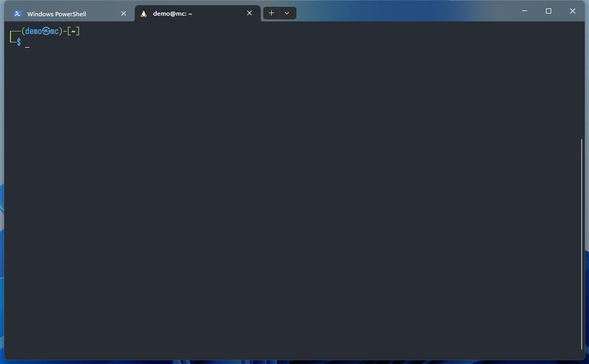

# 在 Windows 中启用 `WSL` 以进行前端开发

`WSL`(适用于 Linux 的 Windows 子系统) 可让开发人员直接在 Windows 上按原样运行 GNU/Linux 环境（包括大多数命令行工具、实用工具和应用程序），且不会产生传统虚拟机或双启动设置开销。可通过下列步骤在启用 `WSL` 并搭建前端开发环境。

### 1. 设备开启虚拟化

打开 "设备管理器" 确认 "虚拟化" 已开启, 若未开启, 需在 Bios 设置中开启虚拟化, 各设备的 Bios 设置不同, 此处请自行搜索.

### 2. Windows 启用相应功能

1. 以管理员身份运行 PowerShell, 输入命令 `dism.exe /online /enable-feature /featurename:Microsoft-Windows-Subsystem-Linux /all /norestart` 以启用 `WSL` 功能.

2. 以管理员身份运行 PowerShell, 输入命令 `dism.exe /online /enable-feature /featurename:VirtualMachinePlatform /all /norestart` 以启用 `虚拟机平台` 功能.

_注意: 你也可以直接搜索 "启用或关闭 Windows 功能", 在操作面板中勾选 "适用于 Linux 的 Windows 子系统" 和 "虚拟机平台"_

下载 Linux 内核更新包 [https://wslstorestorage.blob.core.windows.net/wslblob/wsl_update_x64.msi](https://wslstorestorage.blob.core.windows.net/wslblob/wsl_update_x64.msi), 若为 Windows11 系统可跳过该步.

3. 在 PowerShell 运行 `wsl --set-default-version 2` 将 WSL2 设置为默认版本

_注意: 更多命令可输入 `wsl --help` 查看_

### 3. 下载, 安装 Linux 分发版

可通过 Windows 应用商店或命令行方式安装适用于 `WSL` 的 Linux 分发版, 以下以命令行安装为例:

在 Windows 终端输入命令 `wsl --list --online`, 查看所有可安装的 Linux 发行版

通过 `wsl --install <name>` 命令安装指定发行版, 按提示设置用户名, 密码后等待安装完成即可

安装好之后通过命令 `wsl --list` 即可查看本地安装的所有 Linux 子系统

### 4. 安装配置 Windows 终端

1. 在应用商店搜索安装 `Windows Terminal` 作为默认终端
   

2. 点击添加配置文件, 复制一份对应 Linux 发行版的配置文件
   

3. 通过下拉框新建一个标签页打开对应终端
   

之后便可以正常安装`Git`, `nvm` 等工具配置前端环境了
